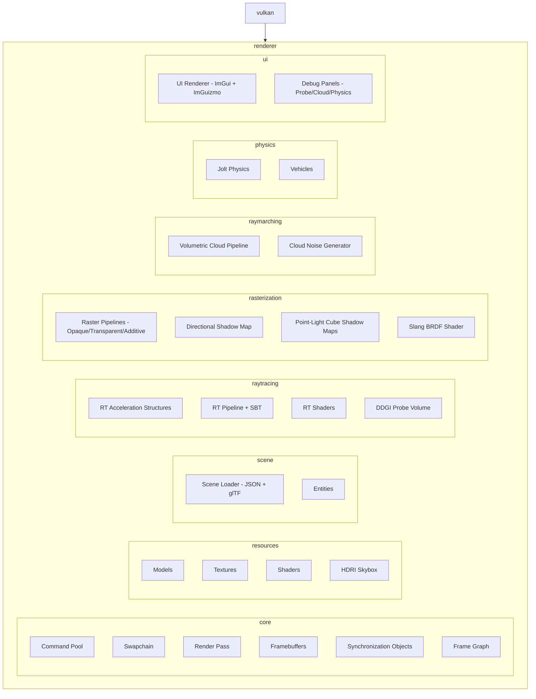

# MukkiGamesEngine

A real-time Vulkan game engine written in C++20 with three rendering modes — **rasterization**, **ray tracing (path tracing)**, and **compute** — plus ray-marched volumetric clouds, Jolt physics, and a DDGI-style probe-based global illumination system. Render modes share one material system, one light pipeline, and one scene format so the raster and path-traced outputs can be compared side by side.

## Features

### Rasterization (Slang `brdf.slang` + DDGI probes)
- **Cook-Torrance PBR** — GGX microfacet distribution, Schlick-GGX geometry, Fresnel with thin-film **iridescence**, and **clear coat** layering
- **DDGI-style probe GI** — a ray-traced probe volume updates every frame (256 rays/probe, octahedral radiance atlas + depth-moments atlas) and feeds the raster pass:
  - Trilinear + octahedral + Chebyshev + backface-weighted sampling
  - **Probe relocation** for probes trapped in geometry (bounded to their grid cell), per-probe **quality classification**, and **history reset on relocation**
  - **BRDF sampling**: cosine-weighted multi-tap diffuse + roughness-cone specular taps (live "BRDF taps" quality knob)
  - **Probe-stored shadow information** — per-direction sun visibility in the atlas alpha channel gives soft contact shadows
  - Automatic field refresh when lights move
  - **Live Probe Debug panel**: GI strength, feedback gain, hysteresis, normal bias, max ray distance, tap count, shadow strength, debug views (GI-only, GI heatmap, probe cells, probe quality), irradiance/depth **atlas previews**, relocation statistics, and a 3D probe overlay (relocated probes in red)
- **Glass parity with the path tracer** — KHR_materials_transmission surfaces sample the probe field along the reflection direction, Beer-Lambert absorption, Fresnel-weighted alpha (no cubemap sampling)
- **Emissive materials** (factor + texture, unshadowed — matches the RT path)
- **Shadows** — PCF directional shadow map + up to 4 point-light **cube shadow maps** in a frame graph
- **Post processing** — Reinhard tone mapping + sRGB encode, identical to the ray-tracing path

### Ray Tracing (`rt.rgen`)
- **Path tracing with accumulation** (frame-averaged, converging image)
- Glass rendering with **iridescence**, **dispersion**, transmission, diffuse transmission, and volume attenuation
- **Emissive** surfaces
- Hard shadows from directional **and** point lights (opaque + 50% glass attenuation)
- Skybox cubemap fallback on miss rays

### Ray Marching
- **Volumetric clouds** (experimental) — Perlin-Worley 3D noise generated on the GPU, 2D weather map for coverage, live cloud debug window with noise preview

### Lighting
- Up to **8 lights**: directional, point (with cube shadow maps), and spot
- ImGui lighting window + **ImGuizmo light gizmo** for placement
- Ambient term + HDR skybox environment

### Materials (glTF via tinygltf)
- Metallic-roughness PBR, `KHR_materials_transmission` (glass), `KHR_materials_diffuse_transmission`, `KHR_materials_volume`, `KHR_materials_iridescence`, `KHR_materials_pbrSpecularGlossiness`, `KHR_materials_clearcoat`, `KHR_texture_transform`, emissive (factor + texture), MSFT_texture_dds/KTX inputs

### Physics (Jolt)
- Rigid body simulation, **vehicle physics** (throttle/brake/steering, gears, RPM), physics debug rendering

### Engine / Tooling
- Vulkan instance/device/swapchain abstraction with RAII (`DeletionQueue`)
- **Frame graph** with transient resource management (shadow passes)
- Compute pipeline mode + ray-tracing pipeline mode toggle
- HDR **skybox** loading (equirectangular → cubemap)
- **Scene loader** — custom JSON scene format + glTF models (`std::async` parallel model loading), scene switching at runtime
- **ImGui + ImGuizmo** tooling: camera info, model/object transforms, lighting, light gizmo, scene loader, RT accumulation controls, cloud noise editor, physics debug, probe debug, variant viewer
- **RenderDoc** capture support, **Tracy** profiling instrumentation
- Swapchain resize handling, validation layers, debug line renderer (probe/physics overlays)

## Progress

| Type of Rendering | Techniques | Images |
| ----------- | ------------ | ------------ |
| RayTracing | Glass Rendering + Iridescence |   |
| RayTracing | Dispersion |  |
| RayTracing | Shadows from directional and point lights |  |
| RayTracing | Path tracing (accumulation, emissive, full material system) | |
| RayMarching | Volumetric Clouds (experimental) |    |
| Rasterization | Shadows (directional PCF + point-light cube maps) |   |
| Rasterization | BRDF Basic Shine |   |
| Rasterization | DDGI probe global illumination (relocation, classification, BRDF taps, probe shadows) | |
| Rasterization | Glass + emissive parity with the path tracer | |
| Physics | Jolt rigid bodies + vehicles | |

## Build (Windows)
### Prerequisites
- **CMake 3.31.4+** (3.16 minimum) and **Ninja**
- **Conan 2.x**
- **Vulkan SDK** (LunarG) for headers/loader + `glslc`
- **Slang** compiler for `slangc` (or `SLANG_ROOT` set)
- **Visual Studio** with MSVC toolchain + Windows SDK

### Configure & build (Release)
> Run these commands from the **x64 Native Tools Command Prompt for VS** so `cl.exe` is available.

```sh
cd Main

conan profile detect --force

# Recommended: use Conan preset with Ninja
conan install . -of build --build=missing -s build_type=Release -s compiler.cppstd=20 -c tools.cmake.cmaketoolchain:generator=Ninja
cmake --preset conan-release
cmake --build --preset conan-release
```

If you prefer not to use presets, configure directly:

```sh
cmake -S . -B build -G Ninja "-DCMAKE_TOOLCHAIN_FILE=build/conan_toolchain.cmake" -DCMAKE_BUILD_TYPE=Release
cmake --build build
```

### Debug build
Use a separate build folder for Debug to avoid mixing configs:

```sh
cd Main

conan install . -of build-debug --build=missing -s build_type=Debug -s compiler.cppstd=20 -c tools.cmake.cmaketoolchain:generator=Ninja
cmake --preset conan-debug
cmake --build --preset conan-debug
# go into build folder you adjust backends in the future and run the sample scene to load first 
cd build-debug
./MukkiGamesEngine --backend vulkan --scene ../MukkiGamesEngine/Assets/sceneTrack.json
```

## Current Progress
- [x] abstract code from tracer rounds for basic instance and device setup
- [x] setup Vulkan instance and device
- [x] create window with GLFW
- [x] create Vulkan surface with GLFW
- [x] setup swapchain
- [x] create image views for swapchain images
- [x] create render pass
- [x] create framebuffers
- [x] create command pool and command buffers
- [x] create synchronization objects
- [x] basic rendering loop to clear screen with a color
- [x] render 3d objects
- [x] skybox
- [x] render cubmaps
- [x] create scene loader
    - [x] SceneObject
    - [ ] Shader hot reloading
- [x] Basic raytracing pipeline (TLAS/BLAS, SBT, rgen/rmiss/rchit shaders)
- [x] RT lighting with shadows and BRDF
	- [x] BRDF
	- [x] Shadows
- [x] RT cubemap skydome fallback
- [x] Raster BRDF (Cook-Torrance + clear coat + iridescence)
- [x] Raster shadows (directional PCF + point-light cube maps)
- [x] DDGI-style probe global illumination (relocation, classification, BRDF taps, probe shadows, debug panel)
- [x] Volumetric clouds (experimental)
- [x] Jolt physics (rigid bodies + vehicles)
- [ ] looking into SIMD
- [ ] multithreading for rendering and resource loading
	- [x] std::async for model loading
 	- [ ] subcommandbuffers? 
## Fixes
- [x] recreating swapchain on window resize
- [x] validation layers errors when switching from compute to graphics and back
- [x] Abstract Vulkan calls to a draw function that we pass the scene path too.
- [x] RAII cleanup (tech depth)
	- [x] adding unique_ptrs to member variables in VkApplication
 	- [x] fixing dangling ptrs in code after switching scenes

## Architecture Diagram

