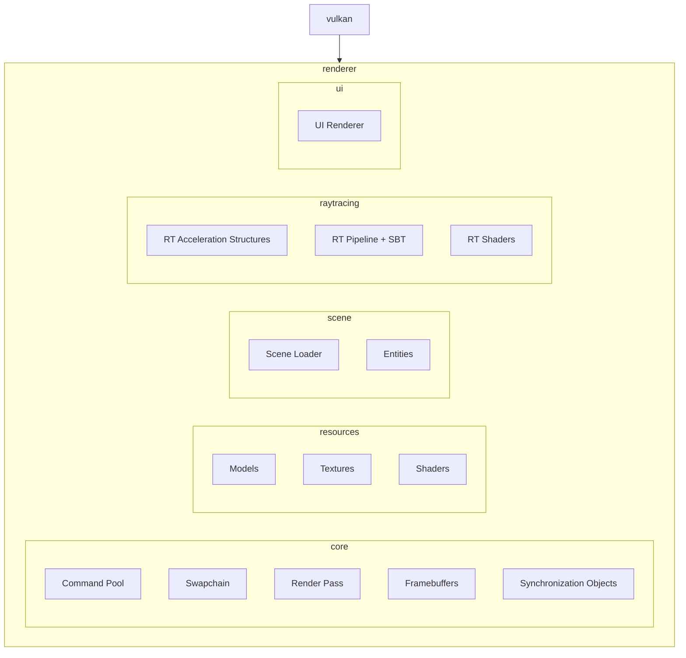

# MukkiVkRenderer
Renderer Project following a rewrite of the original Vulkan tutorial. General-purpose renderer for learning and implementing new rendering techniques. This project is designed for rendering multiple glTF objects and multiple lights using principal BRDF techniques in real-time. 
I will keep adding new rendering techniques here 😁
## Progress

| Type of Rendering | Techniques | Images |
| ----------- | ------------ | ------------ |
| RayTracing  | Glass Rendering Iridescene|  |
|			  |        Dispersion          | 
|			| Emissive Coal | |
|			| Shadows from directional and point lights with ray-queried shadows | | 
|           | GPU Mesh instancing                               |  |
|              |   Dyanmic Diffuse Global illumination               | |
| RayMarching | Volumetric Clouds(still experimental) |   
| Rasterization | Shadows |   |

|             | BRDF Basic Shine |   


## Build (Windows)
### Prerequisites
- **CMake 3.31.4+** (3.16 minimum) and **Ninja**
- **Conan 2.x**
- **Vulkan SDK** (LunarG) for headers/loader + `glslc`
- **Slang** compiler for `slangc` (or `SLANG_ROOT` set)
- **Visual Studio** with MSVC toolchain + Windows SDK

### Configure & build (Release)
> Run these commands from the **x64 Native Tools Command Prompt for VS** so `cl.exe` is available.

```sh
cd Main

conan profile detect --force

# Recommended: use Conan preset with Ninja
conan install . -of build --build=missing -s build_type=Release -s compiler.cppstd=20 -c tools.cmake.cmaketoolchain:generator=Ninja
cmake --preset conan-release
cmake --build --preset conan-release
```

If you prefer not to use presets, configure directly:

```sh
cmake -S . -B build -G Ninja "-DCMAKE_TOOLCHAIN_FILE=build/conan_toolchain.cmake" -DCMAKE_BUILD_TYPE=Release
cmake --build build
```

### Debug build
Use a separate build folder for Debug to avoid mixing configs:

```sh
cd Main

conan install . -of build-debug --build=missing -s build_type=Debug -s compiler.cppstd=20 -c tools.cmake.cmaketoolchain:generator=Ninja
cmake --preset conan-debug
cmake --build --preset conan-debug
# go into build folder you adjust backends in the future and run the sample scene to load first 
cd build-debug
./MukkiGamesEngine --backend vulkan --scene ../MukkiGamesEngine/Assets/sceneTrack.json

```


## Current Progress
- [x] abstract code from tracer rounds for basic instance and device setup
- [x] setup Vulkan instance and device
- [x] create window with GLFW
- [x] create Vulkan surface with GLFW
- [x] setup swapchain
- [x] create image views for swapchain images
- [x] create render pass
- [x] create framebuffers
- [x] create command pool and command buffers
- [x] create synchronization objects
- [x] basic rendering loop to clear screen with a color
- [x] render 3d objects
- [x] skybox
- [x] render cubmaps
- [x] create scene loader
    - [x] SceneObject
    - [ ] Shader hot reloading
- [x] Basic raytracing pipeline (TLAS/BLAS, SBT, rgen/rmiss/rchit shaders)
- [x] RT lighting with shadows and BRDF
	- [x] BRDF
 	- [x] Shadows	
- [x] RT cubemap skydome fallback
- [ ] RenderGraph
	- [x] Basic Rewrite for VKapplication
 	- [ ] Json format for renderpasses
- [ ] Adding GLTF 2.0 Support
	- [x] Glass Dispersion
 	- [x] Glass Iridescence
  	- [x] Specular Support
  	- [x] Transmission Support
  	- [x] GPU mesh instancing
  	- [x] IOR
  	- [ ] Mesh Shader Support
- [ ] looking into SIMD
- [ ] multithreading for rendering and resource loading
	- [x] std::async for model loading
 	- [ ] subcommandbuffers? 
## Fixes
- [x] recreating swapchain on window resize
- [x] validation layers errors when switching from compute to graphics and back
- [x] Abstract Vulkan calls to a draw function that we pass the scene path too.
- [x] RAII cleanup (tech depth)
	- [x] adding unique_ptrs to member variables in VkApplication
 	- [x] fixing dangling ptrs in code after switching scenes
## Architecture Diagram



